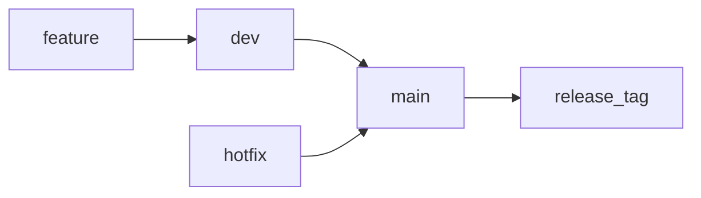

You’re building infrastructure software — so you need **rituals**, not random git usage.

---

# 📘 FA3H – Git Ritual & Branch Discipline

> This document defines how code is committed, branched, merged, and released in FA3H.
> Follow it strictly to maintain clean open-source history.

---

# 🧠 Philosophy

FA3H is infrastructure software.

We prioritize:

* Stability of `main`
* Clean history
* Small focused commits
* Feature isolation
* Semantic releases

No chaos. No giant commits. No direct pushes to main.

---

# 🌳 Branch Structure

```text
main        → Always stable, production-ready
dev         → Integration branch
feature/*   → Short-lived feature branches
hotfix/*    → Emergency fixes for main
```

---

# 🔁 Branch Flow



---

# 🚀 Daily Development Ritual

## 1️⃣ Always Start From dev

```bash
git checkout dev
git pull
```

Never start new work from main.

---

## 2️⃣ Create Feature Branch

Format:

```text
feature/<short-description>
```

Examples:

```text
feature/radius-header
feature/attribute-parser
feature/password-decrypt
feature/response-authenticator
feature/fmc-integration
```

Command:

```bash
git checkout -b feature/radius-header
```

---

## 3️⃣ Work in Small Logical Steps

Commit frequently.

Good commit:

```bash
git commit -m "Add RADIUS header struct parsing"
```

Bad commit:

```bash
git commit -m "changes"
```

---

# ✍ Commit Message Format

Use this structure:

```text
<type>: <short description>

(optional detailed explanation)
```

Types:

* feat → new feature
* fix → bug fix
* refactor → code restructuring
* docs → documentation
* test → testing related
* chore → maintenance

Examples:

```text
feat: implement RADIUS header parsing

Adds binary struct unpacking for Code, Identifier, Length, and Authenticator.
```

```text
fix: correct bcrypt encoding bug
```

---

# 🔄 Merging a Feature

When feature is complete:

```bash
git checkout dev
git pull
git merge feature/radius-header
git push
```

Then delete branch:

```bash
git branch -d feature/radius-header
git push origin --delete feature/radius-header
```

Feature branches should never live long.

---

# 🚢 Releasing to main

When dev is stable:

```bash
git checkout main
git pull
git merge dev
git push
```

Tag release:

```bash
git tag v0.1.0
git push origin v0.1.0
```

---

# 🏷 Versioning Rules (Semantic Versioning)

Format:

```text
MAJOR.MINOR.PATCH
```

Example:

```text
v0.1.0 → Basic auth engine complete
v0.2.0 → RADIUS packet parsing added
v0.3.0 → Password decryption implemented
v1.0.0 → FMC-compatible release
```

Rules:

* PATCH → bug fix
* MINOR → backward-compatible feature
* MAJOR → breaking change

---

# 🚑 Hotfix Ritual

If main breaks:

```bash
git checkout main
git checkout -b hotfix/password-bug
```

Fix it:

```bash
git commit -m "fix: correct password comparison logic"
```

Merge into main:

```bash
git checkout main
git merge hotfix/password-bug
git push
```

Then sync dev:

```bash
git checkout dev
git merge hotfix/password-bug
git push
```

Delete hotfix branch.

---

# 🚫 Forbidden Practices

❌ Direct commits to main
❌ Giant 500-line commits
❌ Long-lived feature branches
❌ Mixing multiple features in one branch
❌ Pushing broken code to dev

---

# 📦 File Hygiene

Always ignore:

```text
venv/
__pycache__/
*.pyc
.DS_Store
.env
```

Ensure `.gitignore` is correct before first major commit.

---

# 🧪 Before Merging to dev

You must verify:

* Project runs
* No syntax errors
* Auth engine works
* No debug prints left

---

# 🧭 Milestone Strategy for FA3H

Each release should correspond to a real capability:

| Version | Capability              |
| ------- | ----------------------- |
| v0.1.0  | Auth engine complete    |
| v0.2.0  | RADIUS header parsing   |
| v0.3.0  | Attribute parsing       |
| v0.4.0  | Password de-obfuscation |
| v0.5.0  | Working custom client   |
| v1.0.0  | FMC login working       |

---

# 🧘 Engineering Discipline Rule

If you cannot explain what a branch contains in one sentence,
the branch is too big.

---

# 🏁 Final Rule

FA3H must always be in a releasable state on `main`.

No exceptions.

---