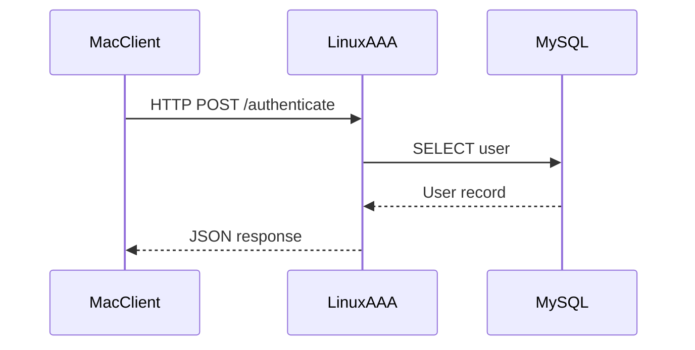
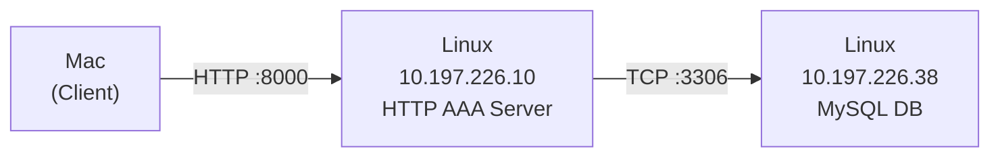
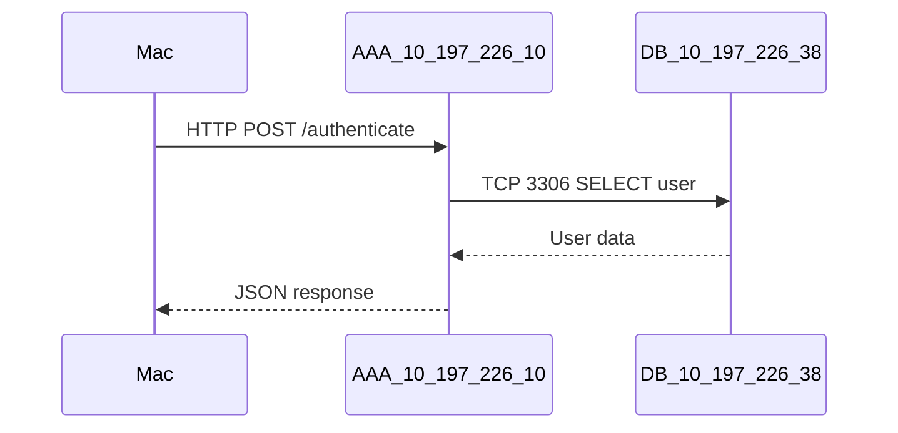
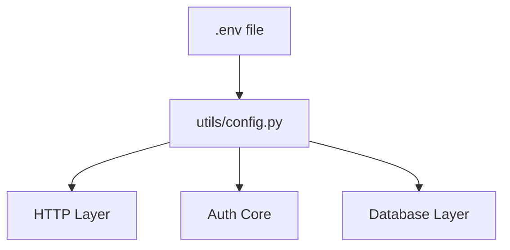
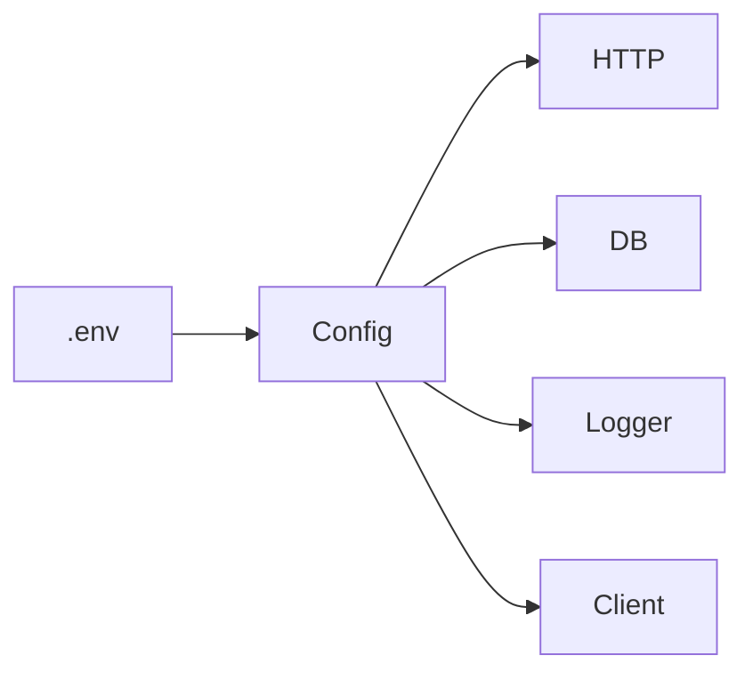

Excellent.
Now we’re doing real distributed testing.

You have:

* Your Mac (dev machine)
* Linux Machine A → `10.197.226.38`
* Linux Machine B → `10.197.226.48`

We’ll design this cleanly and professionally.

---

# 🎯 Target Distributed Test Setup

Let’s define roles first.

Option 1 (Cleanest Separation):


For first test, I recommend:

* AAA Server → `10.197.226.38`
* MySQL → same machine initially (simpler)
* Client → your Mac

We distribute one layer first, not everything at once.

---

# 🧠 Best Way To Transport Code

You have 3 professional options.

## ✅ Option A — Git Clone (Best Practice)

Since your project is already in Git:

On Linux machine:

```bash
git clone https://github.com/<your-username>/FA3H-Flexible-AAA-for-any-Host.git
```

This is the cleanest way.

Why?

* Version controlled
* Repeatable
* Clean updates via `git pull`
* Professional workflow

This is how real systems deploy.

---

## Option B — SCP (Manual Copy)

From your Mac:

```bash
scp -r FA3H-Flexible-AAA-for-any-Host user@10.197.226.38:/home/user/
```

This works but:

* Not version controlled
* Harder to update cleanly

Only good for quick experiment.

---

## Option C — Docker Image (Advanced)

You build a container and deploy.

Too early for now.

---

# 🎯 Correct Choice: Use Git

This keeps your lab machines synchronized with your repo.

---

# 🧱 Step-by-Step Deployment Plan

## Step 1 — SSH Into Linux Machine

From Mac:

```bash
ssh user@10.197.226.38
```

---

## Step 2 — Install Requirements

On Linux machine:

```bash
sudo apt update
sudo apt install python3 python3-venv python3-pip git -y
```

---

## Step 3 — Clone Repo

```bash
git clone https://github.com/<your-username>/FA3H-Flexible-AAA-for-any-Host.git
cd FA3H-Flexible-AAA-for-any-Host
```

---

## Step 4 — Create Virtual Environment

```bash
python3 -m venv venv
source venv/bin/activate
pip install -r requirements.txt
```

---

## Step 5 — Run Server Properly

Important:

Bind to all interfaces:

```bash
uvicorn server.http_server:app --host 0.0.0.0 --port 8000
```

Now the server listens on `10.197.226.38:8000`.

---

# 🧠 Now From Your Mac (Client Side)

Modify client:

```python
SERVER_HOST = "10.197.226.38"
```

Run:

```bash
python client/http_client.py
```

If network allows port 8000, it should work.

---

# 🔥 Important: Firewall Check

If it doesn’t connect:

On Linux machine:

```bash
sudo ufw allow 8000
```

Or temporarily disable firewall for test:

```bash
sudo ufw disable
```

---

# 🧠 What You Just Achieved

Now your architecture becomes real:



Now packets physically leave your Mac,
travel through your lab network,
reach another machine.

This is real distributed validation.

---

# 🚀 Next-Level Testing (Optional)

Once this works:

We can:

* Move MySQL to `10.197.226.48`
* Configure DB_HOST to remote IP
* Test full 3-tier distribution

Then you officially have:

Client → Server → Database
on three physical machines.

That’s serious architecture.

---

# 🧠 Before You Proceed

Tell me:

1. Do both Linux machines have internet access?
2. Do you have GitHub access from them?
3. Is MySQL already installed on either?

Based on that, I’ll tailor the deployment steps exactly for your lab environment.

Good.
Now you are building a real 3-tier distributed system.

Let’s clearly define the architecture first.

---

# 🎯 Final Target Topology



Now every layer is physically separated.

This is proper distributed testing.

---

# 🧠 What Must Be True For This To Work

1. MySQL on `10.197.226.38` must:

   * Be installed
   * Be running
   * Accept network connections
   * Allow AAA server user access

2. AAA server must:

   * Use DB_HOST = `10.197.226.38`
   * Have correct DB credentials

3. Network must:

   * Allow port 3306 from `10.197.226.10` to `10.197.226.38`
   * Allow port 8000 from Mac to `10.197.226.10`

We’ll do this step-by-step cleanly.

---

# 🧱 STEP 1 — Install MySQL on 10.197.226.38

SSH into DB machine:

```bash
ssh user@10.197.226.38
```

Install MySQL:

```bash
sudo apt update
sudo apt install mysql-server -y
```

Start MySQL:

```bash
sudo systemctl start mysql
sudo systemctl enable mysql
```

Check status:

```bash
sudo systemctl status mysql
```

---

# 🧱 STEP 2 — Configure MySQL To Allow Remote Connections

Edit MySQL config:

```bash
sudo nano /etc/mysql/mysql.conf.d/mysqld.cnf
```

Find:

```
bind-address = 127.0.0.1
```

Change to:

```
bind-address = 0.0.0.0
```

Save and restart:

```bash
sudo systemctl restart mysql
```

---

# 🧱 STEP 3 — Create Database + User

Login to MySQL:

```bash
sudo mysql
```

Now inside MySQL:

```sql
CREATE DATABASE fa3h;

CREATE USER 'fa3h'@'10.197.226.10' IDENTIFIED BY 'StrongPass';

GRANT ALL PRIVILEGES ON fa3h.* TO 'fa3h'@'10.197.226.10';

FLUSH PRIVILEGES;
EXIT;
```

Important:

We restricted user to AAA server IP only.
That is secure lab practice.

---

# 🧱 STEP 4 — Allow Port 3306 Through Firewall

On DB machine:

```bash
sudo ufw allow 3306
```

Or if firewall disabled:

```bash
sudo ufw status
```

---

# 🧱 STEP 5 — Update AAA Server Environment Variables

On `10.197.226.10` (AAA server):

Create `.env` file:

```bash
nano .env
```

Add:

```
DB_HOST=10.197.226.38
DB_PORT=3306
DB_USER=fa3h
DB_PASSWORD=StrongPass123
DB_NAME=fa3h
```

Now ensure your DB connection code uses:

```python
import os

DB_HOST = os.getenv("DB_HOST")
DB_PORT = int(os.getenv("DB_PORT", 3306))
DB_USER = os.getenv("DB_USER")
DB_PASSWORD = os.getenv("DB_PASSWORD")
DB_NAME = os.getenv("DB_NAME")
```

If using python-dotenv:

Install it:

```bash
pip install python-dotenv
```

Then in your DB module:

```python
from dotenv import load_dotenv
load_dotenv()
```

Now config is centralized.

---

# 🧱 STEP 6 — Test DB Connectivity From AAA Server

On AAA machine:

```bash
mysql -h 10.197.226.38 -u fa3h -p
```

If this works, network + MySQL config is correct.

If it fails, issue is firewall or bind-address.

---

# 🧠 Now Full Distributed Flow



Now you have:

* Physical separation
* Network transport
* Environment-based config
* Centralized authentication
* Proper DB isolation

This is real distributed infrastructure.

---

# 🧠 What You Just Built

You now have:

Client → App Server → Database
Across 3 physical machines.

That is exactly how production systems are structured.

---

# 🚀 Next Logical Step

Once this works, you have two powerful options:

1. Add TLS between client and server
2. Replace HTTP protocol layer with RADIUS
3. Add logging centralization
4. Add health-check endpoint

Tell me:

Have you installed MySQL on `10.197.226.38` yet?

We’ll debug step-by-step if needed.


---

Excellent.

Now you’re moving from “it works”
to **configuration-driven architecture**.

That’s how real services are built.

We are going to:

* Centralize ALL dynamic parameters
* Remove hardcoded values
* Make behavior fully environment-controlled
* Keep defaults sane
* Prepare for scaling

---

# 🎯 What Counts As “Dynamic”?

Anything that can change between environments:

### Network

* Server host
* Server port
* DB host
* DB port

### Security

* DB user
* DB password
* Shared secret
* Log level

### Runtime

* Timeout values
* Debug mode
* Log format
* Environment name

---

# 🏗 Target Config Architecture



Only `config.py` reads environment.

Everything else imports from config.

---

# 🧱 STEP 1 — Upgrade `.env`

On AAA server:

```env
# Application
APP_ENV=lab
APP_HOST=0.0.0.0
APP_PORT=8000

# Logging
LOG_LEVEL=INFO

# Database
DB_HOST=10.197.226.38
DB_PORT=3306
DB_USER=fa3h
DB_PASSWORD=StrongPass
DB_NAME=fa3h

# HTTP Client Defaults (optional for future)
REQUEST_TIMEOUT=5

# RADIUS (future use)
RADIUS_HOST=0.0.0.0
RADIUS_PORT=1812
RADIUS_SHARED_SECRET=supersecret
```

This is now a real service config.

---

# 🧱 STEP 2 — Centralized Config Loader

Update `utils/config.py`

```python
from dotenv import load_dotenv
import os
from pathlib import Path

BASE_DIR = Path(__file__).resolve().parent.parent
env_path = BASE_DIR / ".env"

load_dotenv(env_path)

# --- App ---
APP_ENV = os.getenv("APP_ENV", "dev")
APP_HOST = os.getenv("APP_HOST", "127.0.0.1")
APP_PORT = int(os.getenv("APP_PORT", 8000))

# --- Logging ---
LOG_LEVEL = os.getenv("LOG_LEVEL", "INFO")

# --- Database ---
DB_CONFIG = {
    "host": os.getenv("DB_HOST"),
    "port": int(os.getenv("DB_PORT", 3306)),
    "user": os.getenv("DB_USER"),
    "password": os.getenv("DB_PASSWORD"),
    "database": os.getenv("DB_NAME"),
}

# --- HTTP ---
AAA_HOST = os.getenv("AAA_HOST", "127.0.0.1")
AAA_PORT = int(os.getenv("AAA_PORT", 8000))
REQUEST_TIMEOUT = int(os.getenv("REQUEST_TIMEOUT", 5))

# --- RADIUS ---
RADIUS_CONFIG = {
    "host": os.getenv("RADIUS_HOST", "127.0.0.1"),
    "port": int(os.getenv("RADIUS_PORT", 1812)),
    "shared_secret": os.getenv("RADIUS_SHARED_SECRET", "supersecret").encode(),
}
```

Now this file is the single source of truth.

---

# 🧱 STEP 3 — Fix Logger To Use Config

Update `utils/logger.py`

```python
import logging
from utils.config import LOG_LEVEL

logging.basicConfig(
    level=LOG_LEVEL,
    format="%(asctime)s | %(levelname)s | %(name)s | %(message)s",
)

def get_logger(name: str):
    return logging.getLogger(name)
```

Now log level is environment-driven.

---

# 🧱 STEP 4 — Fix HTTP Server Startup

Instead of hardcoding:

```bash
uvicorn server.http_server:app --host 0.0.0.0 --port 8000
```

Create `run_server.py`:

```python
import uvicorn
from server.http_server import app
from utils.config import APP_HOST, APP_PORT

if __name__ == "__main__":
    uvicorn.run(app, host=APP_HOST, port=APP_PORT)
```

Now start server with:

```bash
python run_server.py
```

Host and port now come from `.env`.

---

# 🧱 STEP 5 — Fix Client To Use Env

On Mac:

Create `.env` for client:

```env
AAA_HOST=10.197.226.10
AAA_PORT=8000
REQUEST_TIMEOUT=5
```

Update client:

```python
from dotenv import load_dotenv
import os
import requests
from utils.logger import get_logger
from utils.config import AAA_HOST, AAA_PORT, REQUEST_TIMEOUT


SERVER_HOST = AAA_HOST
SERVER_PORT = AAA_PORT
TIMEOUT = REQUEST_TIMEOUT

logger = get_logger(__name__)

def login(username, password):
    url = f"http://{SERVER_HOST}:{SERVER_PORT}/authenticate"
    logger.info("Sending HTTP Post request")

    response = requests.post(
        url,
        json={"username": username, "password": password},
        timeout=TIMEOUT
    )
    return response.json()

if __name__ == "__main__":
    result = login("testuser", "1234")
    print(result)
```

Now client is environment-driven too.

---

# 🧠 Now Your System Is Fully Environment-Controlled



You can now:

* Move between machines
* Change ports
* Change log levels
* Change DB servers
* Change runtime behavior

Without touching code.

---

# 🔥 What You Just Achieved

You moved from:

Hardcoded prototype

To:

Configuration-driven distributed service

That is a huge maturity jump.

---

# 🚀 Next Level Options

Now that config is centralized, you can:

A) Add validation for missing required env variables
B) Add separate configs for dev/lab/prod
C) Implement DB connection pooling
D) Abstract protocol layer for future RADIUS swap

Choose your next architectural brick.

You’re building this correctly.
