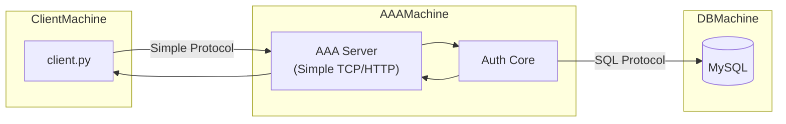

**Before** implementing RADIUS, you should understand **distributed authentication flow** using a simpler protocol.

Let’s build it step by step like a real systems evolution.

---

# 🧠 Stage 0 — What You Have Now

Right now everything runs locally:

```text
client → authenticate() → MySQL
```

All on one machine.

No network.

No protocol.

---

# 🧠 Stage 1 — Separate the Client and AAA Server

Now imagine:

* Machine A → Client
* Machine B → AAA Server
* Machine C → MySQL

Now we have a real distributed system.

We need **two communication channels**:

1. Client ↔ AAA Server
2. AAA Server ↔ MySQL

---

# 🏗 Target Simple Architecture (Before RADIUS)



Now this is a real distributed authentication architecture.

---

# 🔍 Step-by-Step Communication

## Step 1 — Client Sends Request

Client sends something like:

```json
{
  "username": "testuser",
  "password": "1234"
}
```

Over:

* TCP socket
  OR
* HTTP
  OR
* Simple JSON over TCP

Let’s keep it simple: HTTP with FastAPI.

---

## Step 2 — AAA Server Receives

AAA server:

1. Parses JSON
2. Calls authenticate()
3. Gets result from MySQL

---

## Step 3 — AAA Server Queries MySQL

Important detail:

MySQL itself already uses a protocol.

It is not “just a function call.”

AAA server talks to MySQL over:

MySQL wire protocol (TCP 3306)

So your architecture already has:

* One protocol between client and AAA
* One protocol between AAA and DB

You just didn’t think of it that way.

---

## Step 4 — AAA Returns Response

Example response:

```json
{
  "success": true,
  "role": "admin"
}
```

Client prints:

Authentication successful.

---

# 🧠 Why This Step Is Important

This teaches you:

* Network separation
* Service boundaries
* Protocol layering
* Stateless request/response
* Trust boundaries

This is distributed system thinking.

---

# 🔥 What Protocol Should We Use For This Simple Phase?

We have options:

1. Raw TCP with JSON
2. HTTP (REST)
3. gRPC
4. Custom binary protocol

For learning clarity and simplicity:

👉 Use HTTP first.

Because:

* Easy to debug
* Easy to inspect
* No binary headaches yet
* Clean separation

---

# 🧠 What This Teaches Before RADIUS

When you implement this simple HTTP-based AAA:

You will understand:

* Centralized auth server
* Stateless request model
* Security considerations
* How DB is isolated behind auth service
* Why direct DB access from client is bad

Then when we move to RADIUS:

You’ll see that RADIUS is simply:

A different protocol layer on top of the same auth core.

---

# 🧱 Clean Evolution Path

Phase 1:
Client → HTTP → AAA → MySQL

Phase 2:
Client → Custom Binary Protocol → AAA → MySQL

Phase 3:
Client → RADIUS → AAA → MySQL

Same auth core.
Different protocol layer.

That’s clean architecture.

---

# 🧠 The Important Realization

RADIUS is NOT the authentication logic.

RADIUS is just:

The transport + encoding standard for network devices.

Your authentication brain remains the same.

---

# 🎯 So Here’s My Suggestion

Let’s implement:

Minimal HTTP-based distributed AAA.

Using:

* FastAPI (for AAA server)
* requests (for client)
* Your existing authenticate()

Once that works across machines,
we replace HTTP layer with RADIUS layer.

---

