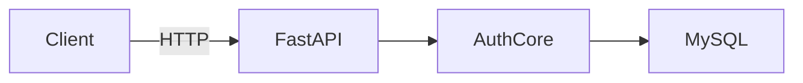

We are now building:

> Phase 1 — Distributed HTTP-based AAA Server
> Clean. Modular. Environment-agnostic.

---

# 🧱 BRICK 1 — Minimal Clean HTTP AAA Server

Goal:

* Client sends POST /authenticate
* Server calls authenticate()
* Server returns JSON response
* Works on localhost
* Later works across machines by just changing IP

Nothing more.

---

# ✅ Step 1 — Install FastAPI + Uvicorn

Inside your venv:

```bash
pip install fastapi uvicorn requests
```

Add them to requirements:

```bash
pip freeze > requirements.txt
```

---

# 🧱 Step 2 — Create HTTP Layer

Create new file:

```text
server/http_server.py
```

Put this inside:

```python
from fastapi import FastAPI
from pydantic import BaseModel
from core.auth_service import authenticate

app = FastAPI()


class AuthRequest(BaseModel):
    username: str
    password: str


@app.post("/authenticate")
def authenticate_user(request: AuthRequest):
    result = authenticate(request.username, request.password)
    return result
```

Notice:

* No DB logic here
* No hashing logic here
* Just protocol layer

Clean separation.

---

# 🧱 Step 3 — Run Server (Local Mode)

From project root:

```bash
uvicorn server.http_server:app --host 127.0.0.1 --port 8000
```

You should see:

```
Uvicorn running on http://127.0.0.1:8000
```

---

# 🧱 Step 4 — Create Client Script

Create:

```text
client/http_client.py
```

Put this inside:

```python
import requests

SERVER_HOST = "127.0.0.1"
SERVER_PORT = 8000

def login(username, password):
    url = f"http://{SERVER_HOST}:{SERVER_PORT}/authenticate"
    response = requests.post(
        url,
        json={"username": username, "password": password},
        timeout=5
    )
    return response.json()


if __name__ == "__main__":
    result = login("testuser", "1234")
    print(result)
```

---

# 🧱 Step 5 — Test It

1. Start server
2. In another terminal:

```bash
python client/http_client.py
```

Expected:

```python
{'success': True, 'role': 'user'}
```

Now test wrong password.

---

# 🧠 What You Just Built

You now have:

* Client → HTTP → AAA server → MySQL
* Clean layering
* Stateless service
* Environment-agnostic communication
* Ready for distributed mode

And we did not modify your auth core at all.

That is clean architecture.

---

# 🧱 BRICK 2 — Make It Environment-Agnostic

Now we improve design slightly.

Update client:

```python
import os
import requests

SERVER_HOST = os.getenv("AAA_HOST", "127.0.0.1")
SERVER_PORT = int(os.getenv("AAA_PORT", 8000))
```

Now:

Local mode:
Nothing changes.

Network mode:

```bash
export AAA_HOST=192.168.1.25
python client/http_client.py
```

Same code.
Different environment.

---

# 🧠 Architecture Status Now



Works locally.
Works across machines.
Scalable.
Replaceable protocol layer.

---

# 🚀 Next Brick

Now we choose direction carefully.

Do we:

A) Add logging & proper error handling
B) Add token-based session concept
C) Refactor config management cleanly
D) Prepare to replace HTTP layer with RADIUS layer

Since we're building brick by brick,
I suggest A next.

You choose the brick.
