We are now building:

> Phase 1 — Distributed HTTP-based AAA Server
> Clean. Modular. Environment-agnostic.

---

# 🧱 BRICK 1 — Minimal Clean HTTP AAA Server

Goal:

* Client sends POST /authenticate
* Server calls authenticate()
* Server returns JSON response
* Works on localhost
* Later works across machines by just changing IP

Nothing more.

---

# ✅ Step 1 — Install FastAPI + Uvicorn

Inside your venv:

```bash
pip install fastapi uvicorn requests
```

Add them to requirements:

```bash
pip freeze > requirements.txt
```

---

# 🧱 Step 2 — Create HTTP Layer

Create new file:

```text
server/http_server.py
```

Put this inside:

```python
from fastapi import FastAPI
from pydantic import BaseModel
from core.auth_service import authenticate

app = FastAPI()


class AuthRequest(BaseModel):
    username: str
    password: str


@app.post("/authenticate")
def authenticate_user(request: AuthRequest):
    result = authenticate(request.username, request.password)
    return result
```

Notice:

* No DB logic here
* No hashing logic here
* Just protocol layer

Clean separation.

---

# 🧱 Step 3 — Run Server (Local Mode)

From project root:

```bash
uvicorn server.http_server:app --host 127.0.0.1 --port 8000
```

You should see:

```
Uvicorn running on http://127.0.0.1:8000
```

---

# 🧱 Step 4 — Create Client Script

Create:

```text
client/http_client.py
```

Put this inside:

```python
import requests

SERVER_HOST = "127.0.0.1"
SERVER_PORT = 8000

def login(username, password):
    url = f"http://{SERVER_HOST}:{SERVER_PORT}/authenticate"
    response = requests.post(
        url,
        json={"username": username, "password": password},
        timeout=5
    )
    return response.json()


if __name__ == "__main__":
    result = login("testuser", "1234")
    print(result)
```

---

# 🧱 Step 5 — Test It

1. Start server
2. In another terminal:

```bash
python client/http_client.py
```

Expected:

```python
{'success': True, 'role': 'user'}
```

Now test wrong password.

---

# 🧠 What You Just Built

You now have:

* Client → HTTP → AAA server → MySQL
* Clean layering
* Stateless service
* Environment-agnostic communication
* Ready for distributed mode

And we did not modify your auth core at all.

That is clean architecture.

---

# 🧱 BRICK 2 — Make It Environment-Agnostic

Now we improve design slightly.

Update client:

```python
import os
import requests

SERVER_HOST = os.getenv("AAA_HOST", "127.0.0.1")
SERVER_PORT = int(os.getenv("AAA_PORT", 8000))
```

Now:

Local mode:
Nothing changes.

Network mode:

```bash
export AAA_HOST=192.168.1.25
python client/http_client.py
```

Same code.
Different environment.

---

# 🧠 Architecture Status Now

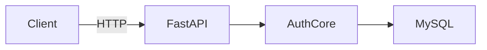

Works locally.
Works across machines.
Scalable.
Replaceable protocol layer.

---

# 🚀 Next Brick

Now we choose direction carefully.

Do we:

A) Add logging & proper error handling
B) Add token-based session concept
C) Refactor config management cleanly
D) Prepare to replace HTTP layer with RADIUS layer

Since we're building brick by brick,
I suggest A next.

You choose the brick.

---

Let’s explain this from absolute zero — assume the person has never heard of:

* API
* Client/Server
* FastAPI
* HTTP
* Requests

We’ll build the understanding layer by layer.

---

# 🧠 First: What Problem Are We Solving?

You have:

* A user
* A username + password
* A database
* Some logic that checks if password is correct

Right now everything runs inside one Python process.

But now we want:

> One program asks another program to authenticate a user.

That’s where **client-server architecture** begins.

---

# 🧱 What Is Client–Server?

Think of it like this:

* Client = the one who asks
* Server = the one who answers

Example in real life:

* You order food → You are the client
* Restaurant kitchen → Server

You don’t walk into the kitchen and cook.
You send a request.

---

# 🏗 Our System Architecture

Here’s what we are building:

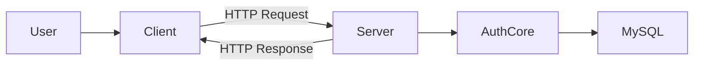

Let’s decode this step by step.

---

# 🧠 What Is HTTP?

HTTP is just a communication language.

It’s the same language browsers use to talk to websites.

When you open:

```
http://google.com
```

Your browser sends an HTTP request.

Google sends an HTTP response.

That’s it.

We are using the same mechanism — just locally.

---

# 🧱 What Is FastAPI?

FastAPI is just a tool that helps us:

* Create a server
* Listen for HTTP requests
* Define routes (endpoints)
* Send responses

It saves us from manually handling sockets.

---

# 🧱 What Is an Endpoint?

An endpoint is just a “door” on the server.

Example:

```
POST /authenticate
```

Means:

If someone sends data to `/authenticate`,
run a specific function.

---

# 🧠 Now Let’s Look at the Code

## Step 1 — Create the Server

```python
from fastapi import FastAPI
```

This imports the tool that helps us create a web server.

---

```python
app = FastAPI()
```

This creates the server object.

Think of it like:

> “Start a restaurant.”

---

## Step 2 — Define What Data We Expect

```python
class AuthRequest(BaseModel):
    username: str
    password: str
```

This says:

When someone sends us data,
it must contain:

* username
* password

And they must be strings.

FastAPI uses this to automatically validate input.

---

## Step 3 — Define the Endpoint

```python
@app.post("/authenticate")
def authenticate_user(request: AuthRequest):
```

This means:

If someone sends an HTTP POST request to:

```
/authenticate
```

Run this function.

---

Inside:

```python
result = authenticate(request.username, request.password)
return result
```

This calls your existing authentication logic.

Notice:

* The server does not know about MySQL.
* The server does not know about bcrypt.
* It only calls the auth core.

That’s separation of concerns.

---

# 🧠 How the Server Actually Runs

You start it using:

```bash
uvicorn server.http_server:app --host 127.0.0.1 --port 8000
```

Let’s decode this:

* `uvicorn` → program that runs your FastAPI app
* `server.http_server:app` → where the server object lives
* `127.0.0.1` → only this machine
* `8000` → port number

Now the server waits for requests.

---

# 🧱 What Is the Client Doing?

Now look at client code:

```python
import requests
```

Requests is a library that lets Python send HTTP requests.

---

```python
url = f"http://{SERVER_HOST}:{SERVER_PORT}/authenticate"
```

This constructs the address of the server.

Example:

```
http://127.0.0.1:8000/authenticate
```

---

```python
response = requests.post(
    url,
    json={"username": username, "password": password},
    timeout=5
)
```

This sends:

* HTTP POST
* JSON data inside body

Like this:

```json
{
  "username": "testuser",
  "password": "1234"
}
```

---

# 🧠 What Happens Internally

Here’s the full flow:

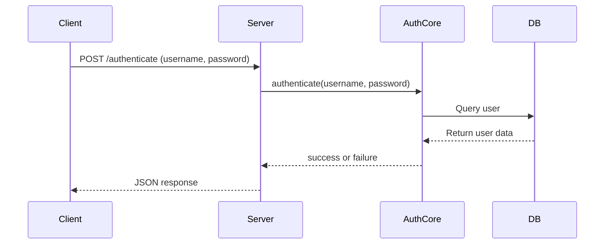

---

# 🧠 Why This Is Important

We just separated:

* Client program
* Authentication server
* Database server

Even if they are on same machine,
they act like separate machines.

This prepares us for real distribution.

---

# 🧠 Now About Scalability

Right now:

SERVER_HOST = "127.0.0.1"

If we change it to:

SERVER_HOST = "192.168.1.25"

Nothing else changes.

Because:

* Protocol (HTTP) remains same
* Message format remains same
* Auth logic remains same

Only network location changes.

That is environment abstraction.

---

# 🧱 Why This Step Matters Before RADIUS

Right now you understand:

* Client asks
* Server processes
* Database responds
* Server replies

When we replace HTTP with RADIUS,
only the outer communication format changes.

The core remains same.

---

# 🧠 The Big Concept You Just Learned

You built a:

Stateless authentication service.

Stateless means:

Each request contains all needed information.

No session stored.

This makes scaling easy later.

---

# 🚀 What We Have Now

You now understand:

* Client
* Server
* Endpoint
* HTTP request
* HTTP response
* JSON payload
* Separation of layers
* Distributed communication

And we didn’t touch RADIUS yet.

---

We’ll let the diagrams do most of the talking.

We will explain:

* What FastAPI does
* What the endpoint decorator does
* What the Pydantic model does
* What the client does
* How HTTP request flows internally
* How data moves through layers

No jargon. Just system mechanics.

---

# 🧱 1️⃣ The Server Object

Code:

```python
app = FastAPI()
```

This creates the server application.

Diagram:

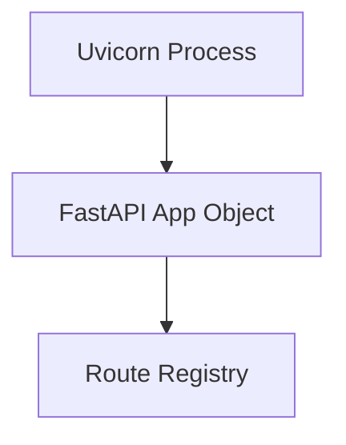

What this means:

* `uvicorn` runs the process
* It loads your `FastAPI` app
* The app maintains a route registry
* Routes tell the app which function to run

---

# 🧱 2️⃣ The Endpoint Decorator

Code:

```python
@app.post("/authenticate")
def authenticate_user(request: AuthRequest):
```

Diagram:


Explanation:

* Server receives HTTP request
* It checks the path
* It finds matching route
* It calls the mapped function
* Function returns data
* FastAPI converts it to JSON

---

# 🧱 3️⃣ Request Body Validation (Pydantic Model)

Code:

```python
class AuthRequest(BaseModel):
    username: str
    password: str
```

Diagram:

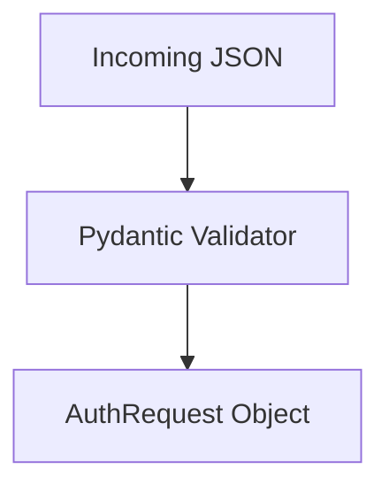

What happens:

* Client sends raw JSON
* FastAPI passes it to Pydantic
* Pydantic checks:

  * Does username exist?
  * Is it a string?
  * Does password exist?
* If valid → creates typed object
* If invalid → returns 422 error automatically

You get validation for free.

---

# 🧱 4️⃣ Inside the Endpoint Function

Code:

```python
result = authenticate(request.username, request.password)
return result
```

Diagram:

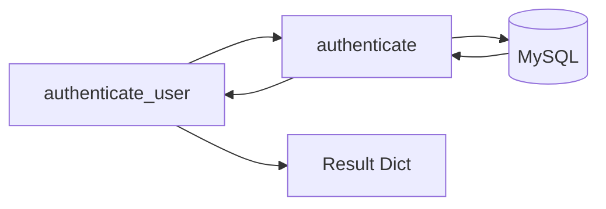

What happens:

* Endpoint extracts fields
* Calls your auth core
* Auth core queries DB
* DB returns data
* Auth core returns success/failure
* Endpoint returns JSON

Notice:

HTTP layer does NOT know SQL.
Auth layer does NOT know HTTP.

Layer separation is clean.

---

# 🧱 5️⃣ The Client Side

Code:

```python
requests.post(url, json={...})
```

Diagram:

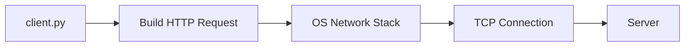

What happens:

* requests builds HTTP message
* OS handles TCP connection
* Data sent over network
* Server receives it

You don’t see TCP,
but it happens underneath.

---

# 🧱 6️⃣ Full End-to-End Flow

This is the complete lifecycle of one login:

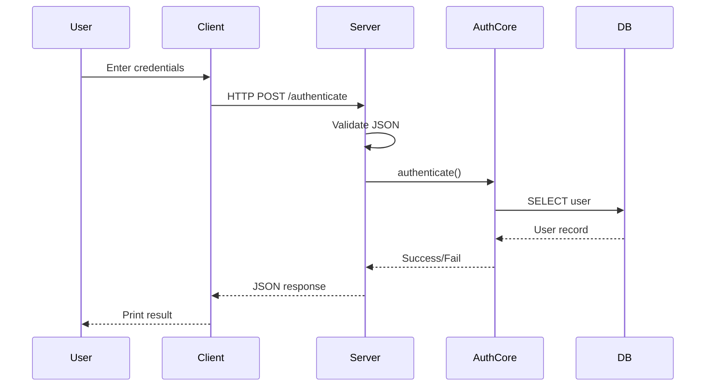

Every arrow is a boundary crossing.

---

# 🧱 7️⃣ Local vs Remote Mode

Same architecture works in both cases:

Local:

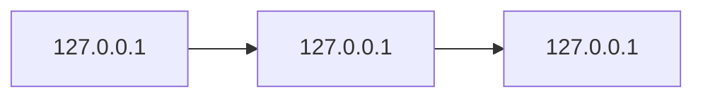

Distributed:

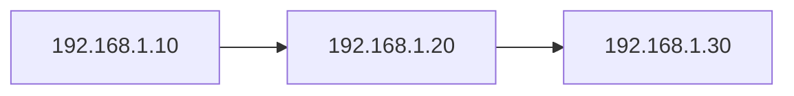

Only IP addresses change.

Flow remains identical.

That’s environment abstraction.

---

# 🧱 8️⃣ Layer Isolation (Most Important Diagram)

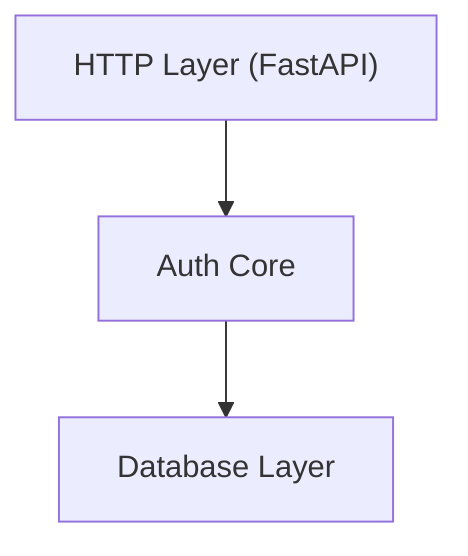

Rules:

* HTTP layer cannot talk directly to DB
* DB layer doesn’t know HTTP exists
* Auth core doesn’t know network details

This is clean architecture.

---

# 🧠 Big Concept Summary

You have built:

* A stateless network service
* A protocol boundary (HTTP)
* A layered architecture
* A distributed-ready system
* A replaceable transport layer

When we replace HTTP with RADIUS later:

Only this block changes:


Becomes:


Everything below remains untouched.

That’s architectural maturity.

---


