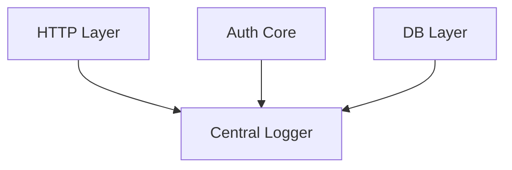
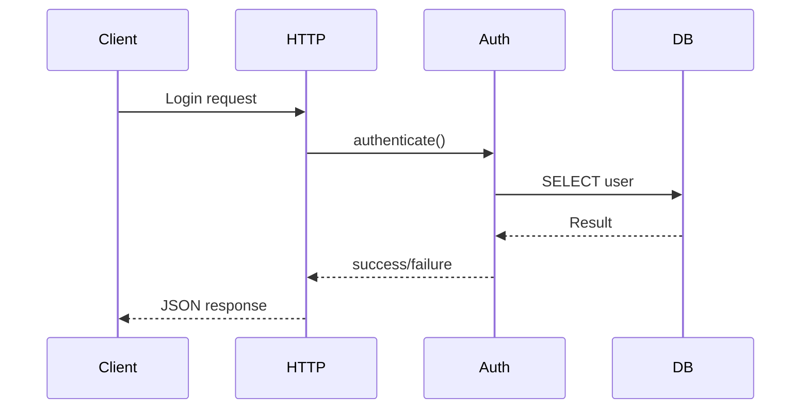

This is the exact right time to introduce logging.

When the codebase is small, logging is easy to structure cleanly.
If you delay it, it becomes messy.

We’re going to design logging like infrastructure software — not print statements.

---

# 🎯 Logging Goals

You said:

> “I want to monitor each and everything from the start.”

So we will log:

1. Incoming authentication requests
2. Validation failures
3. Auth success / failure
4. Database errors
5. Unexpected exceptions
6. Request metadata (IP, timestamp)

But carefully — we must **never log raw passwords**.

---

# 🧠 Logging Architecture (Clean Design)

We don’t sprinkle logging everywhere randomly.

We centralize logging.



All layers use the same logger.

---

# 🧱 BRICK 1 — Create Central Logger

Create:

```text
utils/logger.py
```

Put this inside:

```python
import logging
import os

LOG_LEVEL = os.getenv("LOG_LEVEL", "INFO")

logging.basicConfig(
    level=LOG_LEVEL,
    format="%(asctime)s | %(levelname)s | %(name)s | %(message)s",
)

def get_logger(name: str):
    return logging.getLogger(name)
```

This gives:

* Timestamp
* Log level
* Module name
* Message

Structured and clean.

---

# 🧠 What This Does

When you call:

```python
logger = get_logger(__name__)
```

Each file gets its own logger name.

Example log:

```
2026-03-01 20:14:12 | INFO | server.http_server | Authentication request received
```

That helps when project grows.

---

# 🧱 BRICK 2 — Add Logging to HTTP Layer

Update `server/http_server.py`:

```python
from fastapi import FastAPI, Request
from pydantic import BaseModel
from core.auth_service import authenticate
from utils.logger import get_logger

app = FastAPI()
logger = get_logger(__name__)


class AuthRequest(BaseModel):
    username: str
    password: str


@app.post("/authenticate")
def authenticate_user(request: AuthRequest):
    logger.info(f"Auth attempt for user: {request.username}")

    result = authenticate(request.username, request.password)

    if result["success"]:
        logger.info(f"Authentication success for user: {request.username}")
    else:
        logger.warning(
            f"Authentication failed for user: {request.username} | Reason: {result.get('reason')}"
        )

    return result
```

Notice:

* We log username
* We NEVER log password

---

# 🧱 BRICK 3 — Add Logging to Auth Core

Update `core/auth_service.py`:

```python
from utils.logger import get_logger

logger = get_logger(__name__)
```

Inside function:

```python
logger.debug(f"Fetching user: {username}")
```

Add failure logs:

```python
if not user:
    logger.warning(f"User not found: {username}")
    return {"success": False, "reason": "User not found"}
```

Add inactive log:

```python
if not user["is_active"]:
    logger.warning(f"Inactive user attempted login: {username}")
```

---

# 🧱 BRICK 4 — Add Logging to DB Layer

Inside `db/models.py`:

```python
from utils.logger import get_logger

logger = get_logger(__name__)
```

Before query:

```python
logger.debug(f"Querying DB for user: {username}")
```

After fetch:

```python
if user:
    logger.debug(f"User record found for: {username}")
else:
    logger.debug(f"No DB record for: {username}")
```

---

# 🧠 Full Logging Flow

Now one login attempt produces something like:



And logs:

```
INFO  | Auth attempt for user: testuser
DEBUG | Fetching user: testuser
DEBUG | Querying DB for user: testuser
DEBUG | User record found for: testuser
INFO  | Authentication success for user: testuser
```

This is observability.

---

# 🧠 Why Logging Is Critical for AAA

When you later move to RADIUS:

You will debug:

* Shared secret mismatch
* Wrong packet format
* Invalid password decryption
* Timeout issues

Without structured logging, you will suffer.

Now you’re building observability from day one.

That’s professional.

---

# 🧱 Optional Next Upgrade

We can also:

* Log to file instead of just console
* Add rotating logs
* Add JSON structured logging
* Add request ID correlation

But for now, console logging is enough.

---

# 🚀 Next Question

Do you want to:

A) Add file-based logging
B) Add request tracing (unique request ID per login)
C) Add audit logging separate from debug logs
D) Move toward production hardening

Tell me the next brick.
