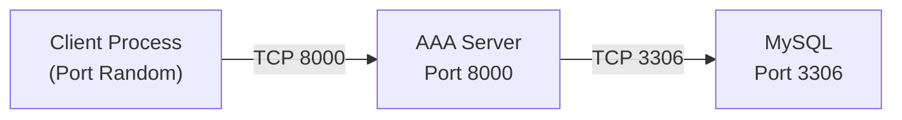
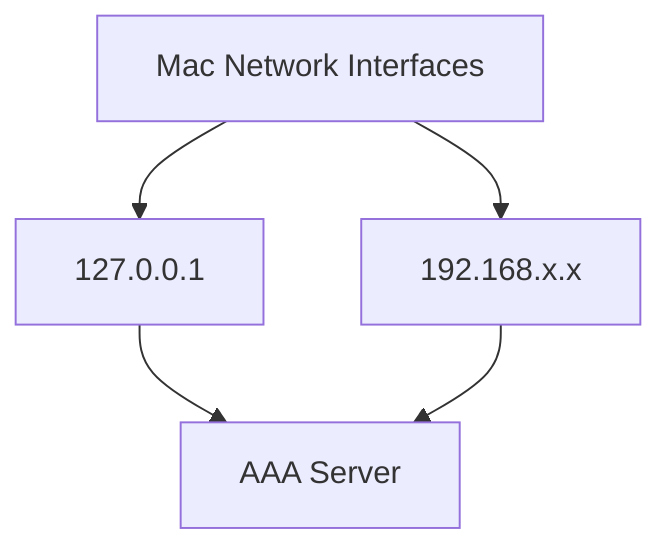
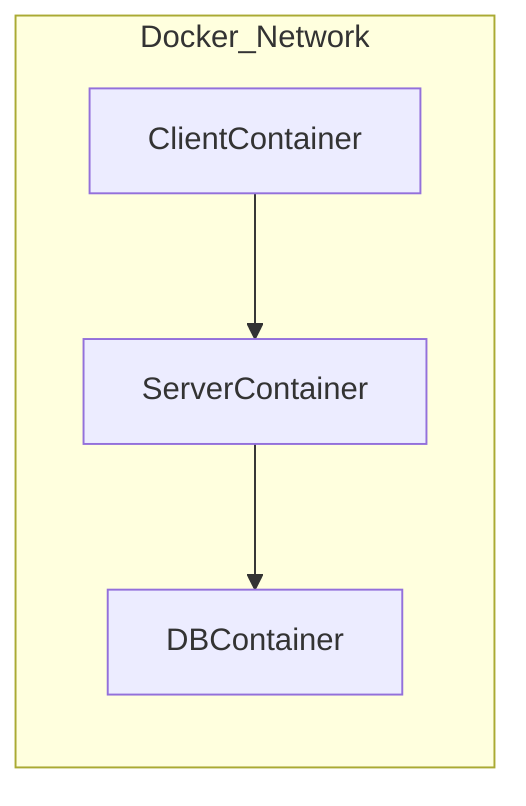
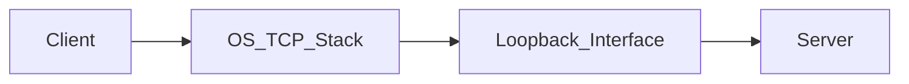

You have **one physical machine**, but that does NOT mean you can’t test distributed behavior.

Let’s break this properly.

---

# 🧠 First: What Does “Distributed” Actually Mean?

Distributed does NOT mean:

> Multiple laptops on a desk.

It means:

> Separate processes communicating over a network boundary.

Even if that “network” is virtual.

---

# 🎯 On One Machine You Can Simulate 3 Real Scenarios

We will simulate:

1️⃣ Client process
2️⃣ AAA server process
3️⃣ Database process

All isolated but running on same OS.

---

# 🧱 Scenario 1 — True Localhost Network (Already Distributed)

Right now:

* Client runs in one terminal
* Server runs in another
* MySQL runs as separate service

Even though IP is `127.0.0.1`, this is already distributed.

Diagram:



This is real TCP communication.

It’s not a function call.

Your OS network stack is involved.

That is legitimate distributed testing.

---

# 🧱 Scenario 2 — Bind Server to 0.0.0.0

Instead of:

```bash
--host 127.0.0.1
```

Run:

```bash
uvicorn server.http_server:app --host 0.0.0.0 --port 8000
```

Now your server listens on ALL interfaces.

Diagram:



Now your own machine can access:

```
http://127.0.0.1:8000
```

OR

```
http://192.168.1.20:8000
```

Even though both are same device.

This simulates real network access.

---

# 🧱 Scenario 3 — Use Docker (Best Simulation)

You can isolate components using containers.

Diagram:



Even on one Mac:

* Each container has its own IP
* They communicate over virtual network
* Feels like separate machines

This is how professionals simulate distributed systems.

---

# 🧠 Scenario 4 — Use Different Ports (Process Isolation)

Even without Docker:

Run:

Terminal 1:

```
Server on port 8000
```

Terminal 2:

```
Client calling 127.0.0.1:8000
```

Terminal 3:

```
MySQL on 3306
```

That’s already 3 independent processes.

Your kernel schedules them separately.

That is distributed enough for now.

---

# 🎯 What Actually Changes When Truly Distributed?

Only this:

```python
SERVER_HOST = "127.0.0.1"
```

Becomes:

```python
SERVER_HOST = "192.168.1.25"
```

Nothing else changes.

Because your system is already network-based.

---

# 🧠 Important Concept: Loopback Is Still a Network

Many beginners think:

> “Localhost is not distributed.”

Wrong.

Localhost still uses:

* TCP stack
* Port binding
* OS networking
* Packet routing (loopback interface)

It just never leaves your machine.

Diagram:



This is real networking.

---

# 🚀 Best Practical Approach For You Right Now

Step 1:
Run server on:

```
--host 0.0.0.0
```

Step 2:
Find your machine IP:

```
ifconfig | grep inet
```

Step 3:
Call server using:

```
http://<your-local-ip>:8000/authenticate
```

Even from same machine.

Now you are simulating real LAN communication.

---

# 🧠 When Should You Use Docker?

When you want to simulate:

* Multiple network namespaces
* Container-level isolation
* Production-like deployment
* Load balancing
* Future scaling

For now, it’s optional.

---

# 🔥 Big Realization

You are already building distributed software.

Because:

* No function calls between client & server
* Communication happens over TCP
* Database accessed over TCP
* Components are process-isolated

The machine count does not define distribution.

Process isolation + network boundary does.

---

# 🎯 Next Question

Do you want to:

A) Simulate real LAN testing using your own IP
B) Containerize everything using Docker
C) Add load balancing simulation
D) Move toward making HTTP layer pluggable (prepare for RADIUS)

Choose your next level.
